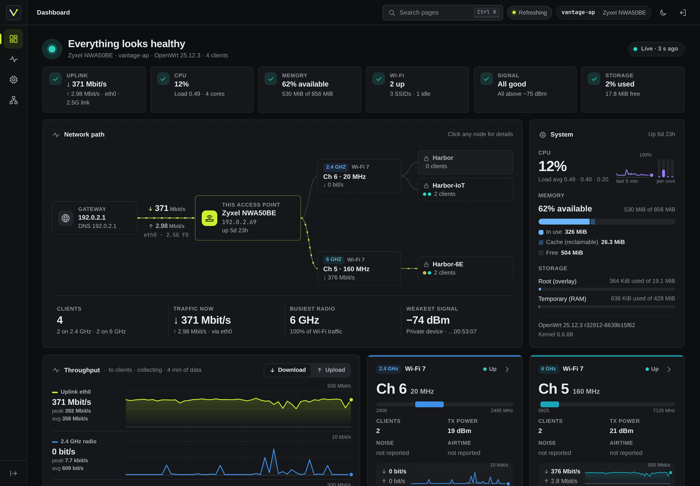
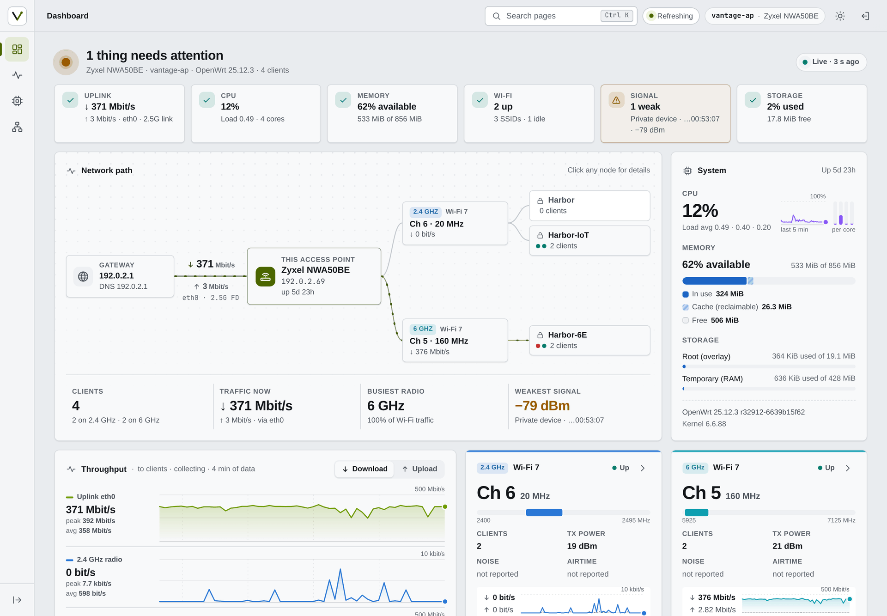
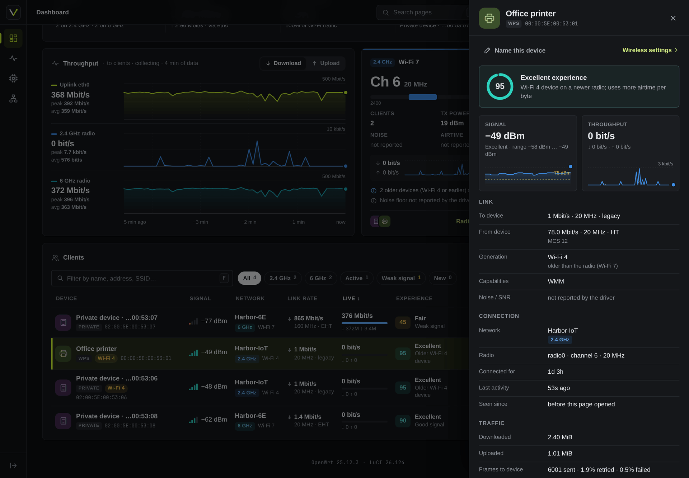
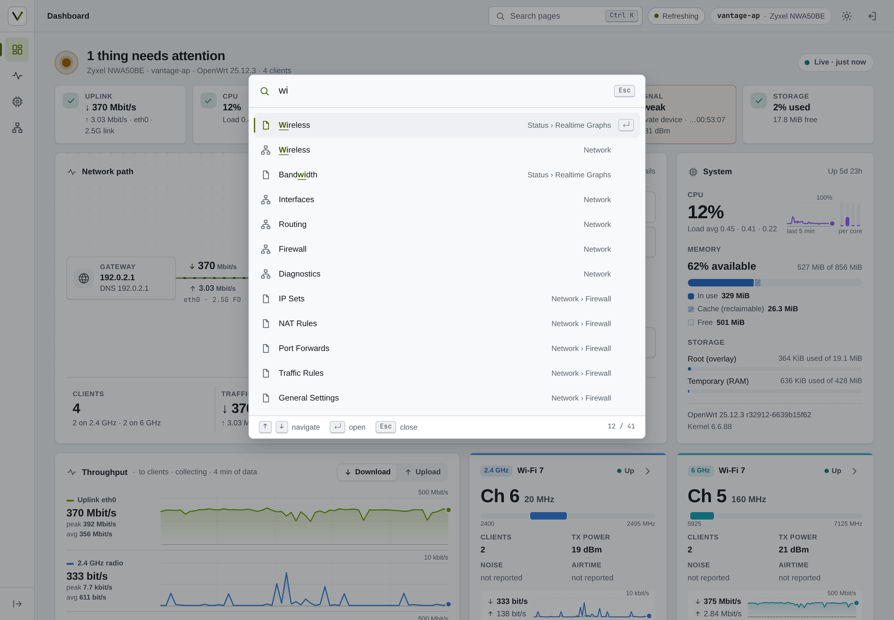
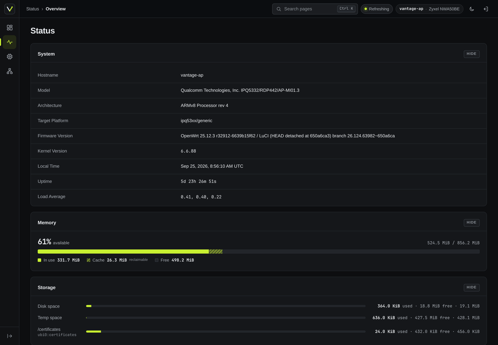
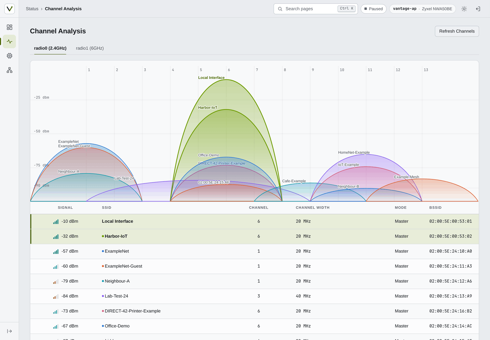
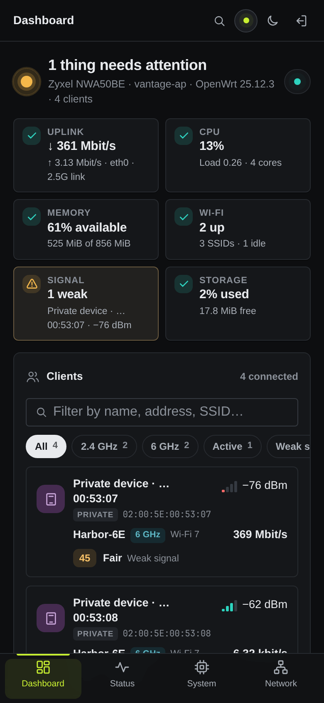

<div align="center">


# Vantage

**A LuCI theme and live network dashboard for OpenWrt 25.12, built from scratch.**

  

</div>

<br>

<p align="center">
  
</p>

<p align="center"><sub>Screenshots show recorded data from a real access point, pseudonymised
(documentation addresses and MACs, neutral names). See <a href="#develop">Develop</a>.</sub></p>

## What you get

Two packages. The app works under any LuCI theme; the theme is useful
without the app.

**`luci-theme-vantage`**, the shell:

- Icon rail with a flyout per category; a bottom bar and sheet on phones
- Breadcrumb, page tabs, and a <kbd>Ctrl</kbd>+<kbd>K</kbd> / <kbd>/</kbd>
  command palette with fuzzy search over every page you can open
- Light, dark and auto modes, applied before first paint (no flash)
- Host chip (hostname and model), LuCI's indicators (including the unsaved
  changes count) as keyboard-accessible pills
- Its own login page, and restyled stock pages, forms, tables, charts and
  status icons; tables become cards on small screens
- System fonts, self-drawn SVG icons, no CDNs or frameworks

**`luci-app-vantage`**, the dashboard at `admin/dashboard` (the landing page):

- Health verdict with checks for uplink, CPU, memory, Wi-Fi, client signal
  and storage, each with a one-line reason
- Network path from gateway to access point, radios and SSIDs; click any
  node for details
- Live throughput for the uplink and every radio (last 5 minutes), radio
  cards with channel, width, TX power and noise
- Clients with human names (your alias, reverse DNS, mDNS, DHCP hints, WPS
  device name, vendor, or "Private device" for randomised MACs), signal,
  link rate, Wi-Fi generation, live traffic and an experience score with
  its reason; filters by band, activity, weak signal and new clients
- Client inspector: signal history, link rates, capabilities, traffic,
  retries; rename a device in place
- Top talkers, wireless networks, system tile (CPU per core, memory,
  storage, firmware)

## Screenshots

<table>
  <tr>
    <td width="50%"></td>
    <td width="50%"></td>
  </tr>
  <tr>
    <td align="center"><sub>Light mode: the health strip flags a weak client</sub></td>
    <td align="center"><sub>Client inspector with experience score, signal and link details</sub></td>
  </tr>
  <tr>
    <td width="50%"></td>
    <td width="50%"></td>
  </tr>
  <tr>
    <td align="center"><sub><kbd>Ctrl</kbd>+<kbd>K</kbd> palette: every page, fuzzy matched</sub></td>
    <td align="center"><sub>Stock Status page under the theme, with a combined memory bar</sub></td>
  </tr>
  <tr>
    <td width="50%" valign="middle"></td>
    <td width="50%" align="center"></td>
  </tr>
  <tr>
    <td align="center"><sub>Stock Channel Analysis (neighbour networks are generated)</sub></td>
    <td align="center"><sub>Phone layout with the bottom bar</sub></td>
  </tr>
</table>

## Install

For OpenWrt 25.12 (apk). Both packages are architecture-independent, so
the same files install on any target. Prebuilt packages are not published
yet; build them as shown below, copy them to the device, then:

```sh
apk add --allow-untrusted ./luci-theme-vantage-*.apk ./luci-app-vantage-*.apk
```

On a fresh install the theme selects itself; an upgrade never overrides the
theme you chose (System → Language and Style). Removing the theme switches
LuCI back to Bootstrap, or to another installed theme.

## Build

With podman and the official OpenWrt SDK image:

```sh
dev/build/sdk-build.sh 25.12.4          # builds HEAD into dist/25.12.4/
```

The script builds from a clean clone of the commit, so the same commit
always produces byte-identical packages; `dist/<release>/SHA256SUMS` lists
their hashes.

## Develop

The UI is developed offline against recorded device data, never against a
live device:

1. **Record** – `dev/mirror/` records a real LuCI session read-only
   (browser and SSH snapshots). Writes, applies, scans and uploads are
   refused before they leave the browser, and secrets are removed before
   anything is written. Recordings stay outside the repository.
2. **Replay** – `dev/replay/` serves the complete LuCI UI from a recording on
   `127.0.0.1`, with the theme and app loaded from this tree; reload to see
   an edit. Save & Apply works against an in-memory overlay.
3. **Demo mode** – `--demo` pseudonymises the recording as it loads:
   documentation MACs and addresses (`00:00:5E:00:53:xx`, `192.0.2.0/24`,
   `2001:db8::/32`), neutral hostname, SSIDs and client names. The
   screenshots above were taken this way.

```sh
node dev/replay/server.js --mirror ../vantage-mirror --port 8106 --demo \
    --theme-dir luci-theme-vantage/htdocs/luci-static/vantage --theme vantage \
    --app-dir luci-app-vantage
```

See [`dev/replay/README.md`](dev/replay/README.md) for all options,
[`docs/SPEC.md`](docs/SPEC.md) for the product and
[`docs/luci-contract.md`](docs/luci-contract.md) for what LuCI expects from a
theme. `dev/icons/build.js` generates the status icon set; `prototypes/`
holds the design prototypes the packages were made from.

Checks:

```sh
node --test tests/
node security-tests/check_dom_sinks.js
node security-tests/check_private_addresses.js [--require-mirror --mirror ../vantage-mirror]
node security-tests/test_templates.js
node security-tests/test_acl_policy.js
```

## Security

- **Read-only dashboard.** The app's rpcd ACL grants read methods only
  (system, network, iwinfo, hostapd status, host hints, reverse DNS, mDNS,
  `/proc/stat`) and no `file.exec`. Its one write, device names, is limited
  to its own `/etc/config/vantage` in a separate ACL group. The read group
  includes `luci-rpc getWirelessDevices`, which returns the wireless
  configuration including Wi-Fi keys; its description says so.
- **No markup from data.** Every DOM node is built with `E()` and text
  nodes; `check_dom_sinks.js` rejects `innerHTML` and other HTML sinks.
- **Templates.** `test_templates.js` renders the theme's templates with
  hostile input and checks that markup stays stable, inline scripts carry
  no data, the login error is generic and logged-out pages reveal nothing
  about the device.
- **ACL policy.** `test_acl_policy.js` checks that the ACL grants exactly
  the methods the app declares, and nothing more.
- **No private data in the tree.** `check_private_addresses.js` rejects
  private IPv4/IPv6 addresses, MACs outside the documentation ranges, and
  the hostnames and SSIDs recorded from the real device.

## Compatibility

| OpenWrt | Status |
|---|---|
| 25.12 | Built with the 25.12 SDK and tested |
| 24.10 | Untested; LuCI contract differences are not verified |

## License

Apache License 2.0, see [`LICENSE`](LICENSE) and
[`luci-theme-vantage/NOTICE`](luci-theme-vantage/NOTICE).
